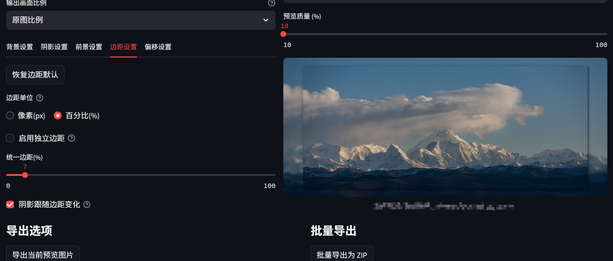

# 毛玻璃相框🖼

🖼本项目是一个基于 Streamlit 和 Pillow 库开发的Web应用，旨在简化图片处理流程，特别是为适应抖音、小红书、B站等平台竖屏内容的需求。提供了一个便捷的工具，可以批量上传图片，通过直观界面调整各种参数，实现以下效果：（直接使用免环境安装的本地包通过网盘分享的文件：blurGlassFrame.zip https://pan.baidu.com/s/1SV2cB2Wrx9-6XocMC6nvtQ?pwd=1234 提取码: 1234 ）


- **毛玻璃模糊背景**: 为前景图片自动生成并添加毛玻璃模糊效果的背景，并提供白/黑的蒙版。
- **柔和的立体阴影**: 为前景图片生成可调整参数的柔和阴影，增强立体感。
- **圆角效果**: 对前景图片应用圆角处理。
- **参数调整**: 提供丰富的参数控制，包括背景启用/禁用、模糊半径、蒙版类型和不透明度；阴影启用/禁用、扩散半径、模糊半径、不透明度、偏移量（支持像素和百分比单位），以及阴影是否跟随前景或边距变化；前景圆角半径；边距设置（统一或独立，支持像素和百分比单位）；前景偏移量（支持像素和百分比单位）。
- **画面比例**: 支持选择多种输出画面比例，如原图比例、9:16、4:5等。
- **预览加载**：减少预览资源消耗。
- **批量处理与下载**: 支持批量上传图片，对多张图片进行批处理，并提供处理后图片的一键打包下载功能

- 🔥**后续更新内容**：1.将支持相机与镜头参数Logo可选填充；2.更快的毛玻璃相框预览与导出；3.更人性化的界面；4.更多的基础样式...

  

------

## 项目结构

```
├─ app.py                # 应用主入口
├─ requirements.txt      # Python依赖清单
├─ model/                # 图像处理模块（背景、阴影、前景处理）
│   ├─ background.py
│   ├─ shadow.py
│   └─ foreground.py
├─ controller/           # 控制器层（业务逻辑中转）
│   ├─ image_controller.py
│   └─ processing_controller.py
├─ view/                 # 界面展示层（Streamlit页面布局）
│   ├─ upload_view.py
│   ├─ param_view.py
│   ├─ preview_view.py
│   └─ output_view.py
└─ README.md              # 项目说明文档
```

------

## 环境依赖

- #### 环境依赖与启动

  - **环境依赖**: 需要 Python 3.8 及以上版本。
  - **安装依赖**: 在项目根目录执行 `pip install -r requirements.txt` 安装所需库。
  - **启动应用**: 在项目根目录执行 `streamlit run app.py`或点击`Start.bat`脚本，应用将在浏览器中打开（http://localhost:8501/）；

```shell
# 第一次环境安装
conda create python=3.9 -n blurGlassFrame

conda activate blurGlassFrame

pip install -r requirements.txt

# （后续）启动
conda activate blurGlassFrame

streamlit run app.py

```

（或者直接使用免环境安装的本地包通过网盘分享的文件：blurGlassFrame.zip
链接: https://pan.baidu.com/s/1SV2cB2Wrx9-6XocMC6nvtQ?pwd=1234 提取码: 1234 
，双击点击start.bat即可启动）


